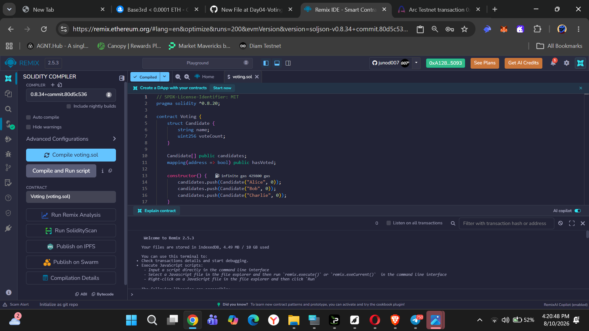
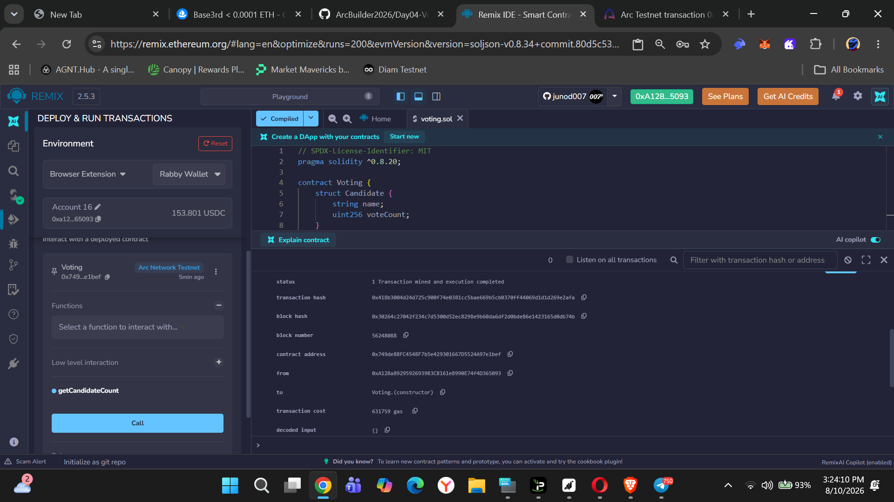
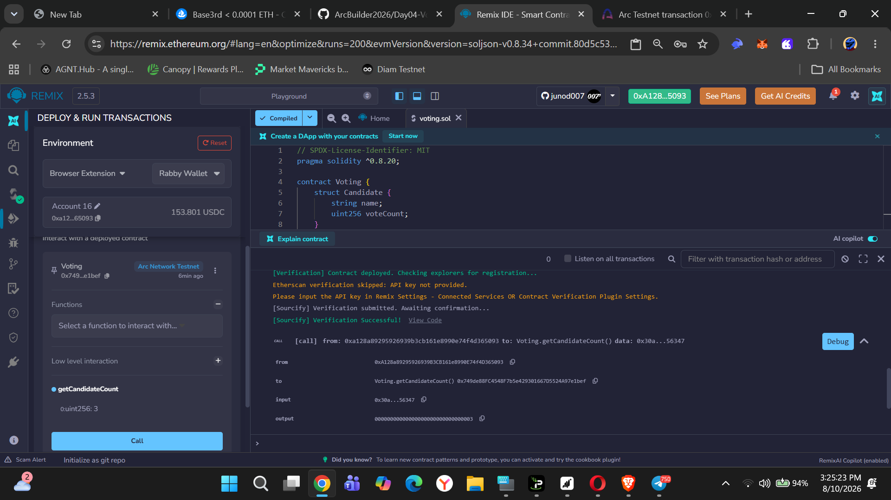
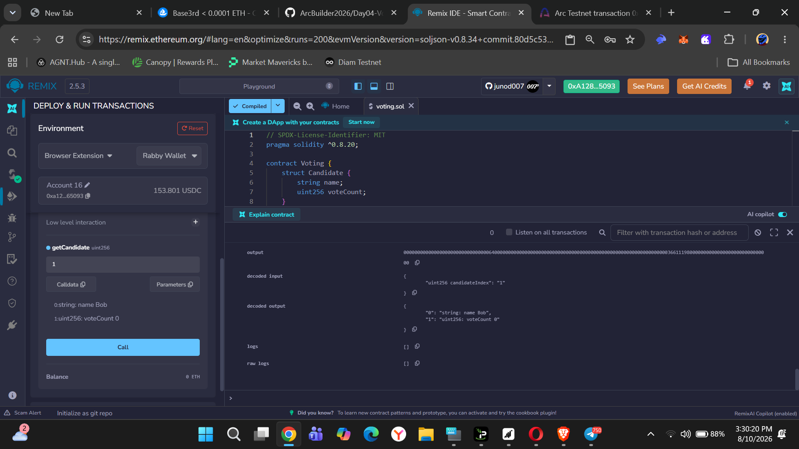
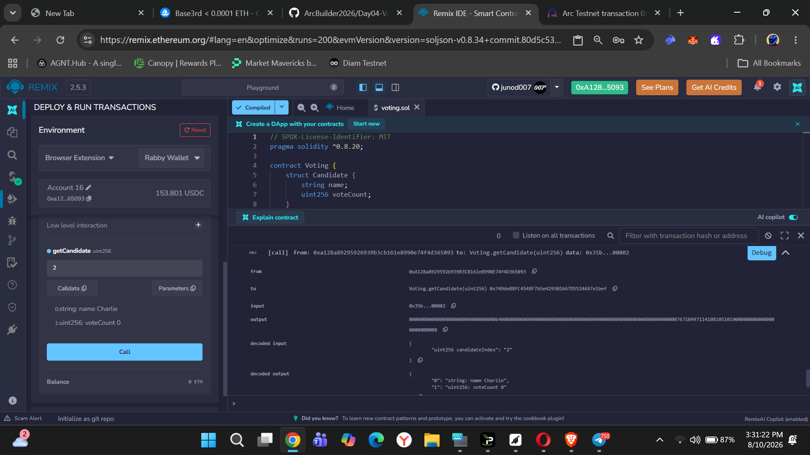
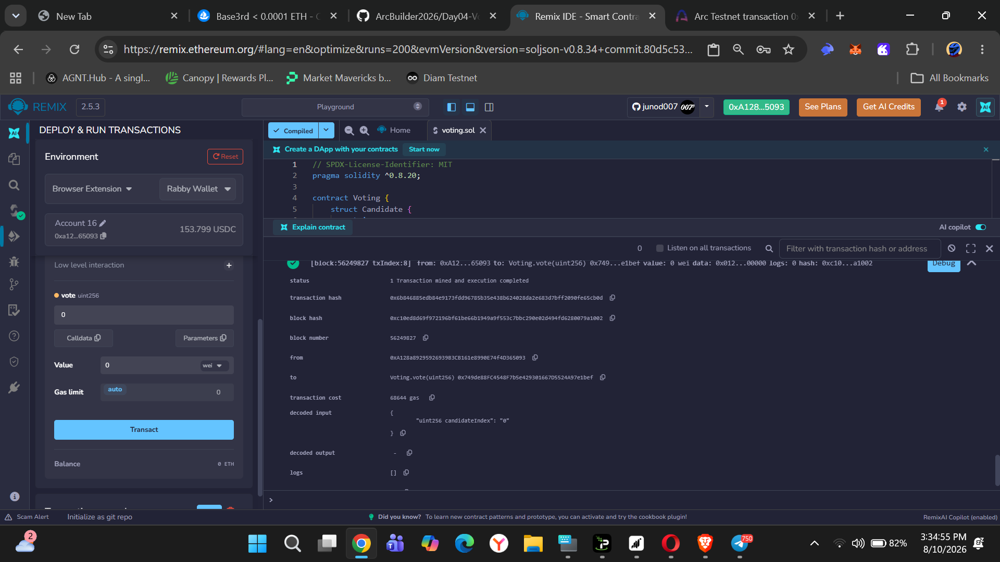
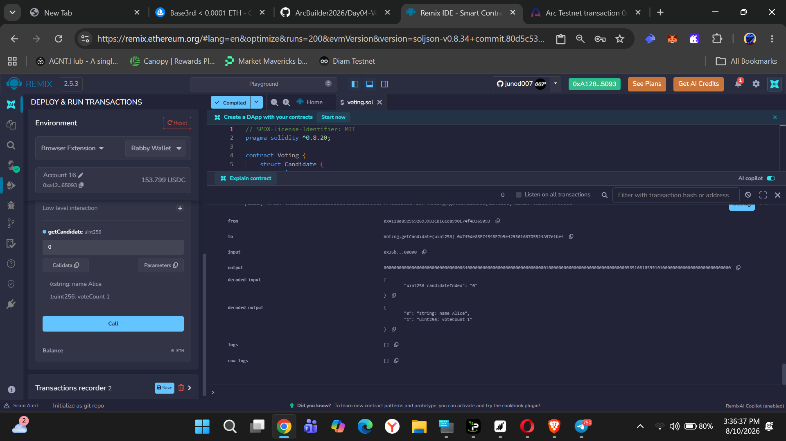
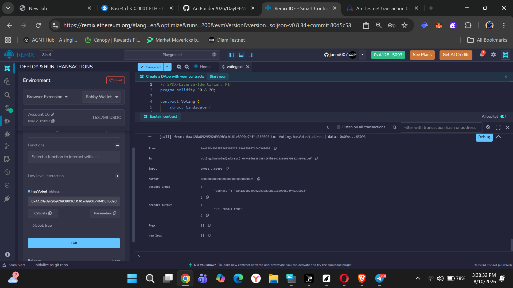

# Day 04 - Voting

## Objective

Build and deploy a simple Voting smart contract on Arc Testnet using Solidity and Remix IDE.

## Smart Contract

The `Voting.sol` contract contains:

- 3 candidates:
  - Alice
  - Bob
  - Charlie
- Vote counting
- Prevention of double voting
- Candidate lookup
- Vote status verification

## Deployment

The Voting smart contract was compiled and deployed successfully to **Arc Testnet** using Remix IDE.

### 1. Compile Contract

### 2. Deploy Contract

## Candidate Verification

### 3. Candidate Count

The contract returns **3 candidates**.

### 4. Alice

### 5. Bob

### 6. Charlie

## Voting

### 7. Vote for Alice

A vote was successfully submitted for Alice.

### 8. Verify Vote Count

The candidate data was queried again after voting.

### 9. Verify Voting Status

The `hasVoted` function confirms that the wallet address has already voted.

## Result

The Voting smart contract was successfully:

- Compiled with Solidity
- Deployed on Arc Testnet
- Tested with 3 candidates
- Used to cast a vote
- Verified through contract read functions

## Network

**Arc Testnet**

## Tools

- Solidity
- Remix IDE
- Arc Testnet
- Rabby Wallet

