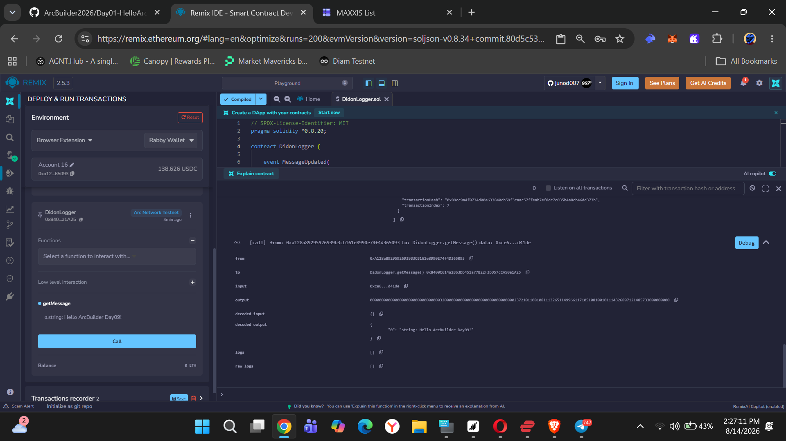
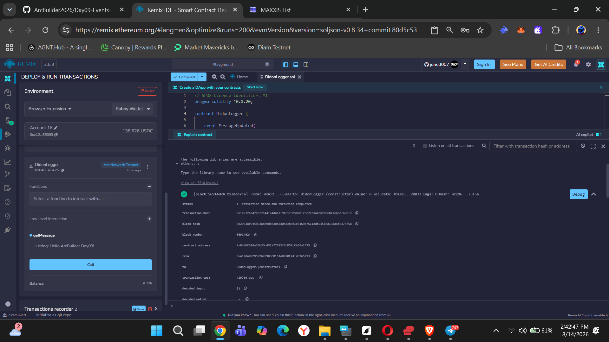
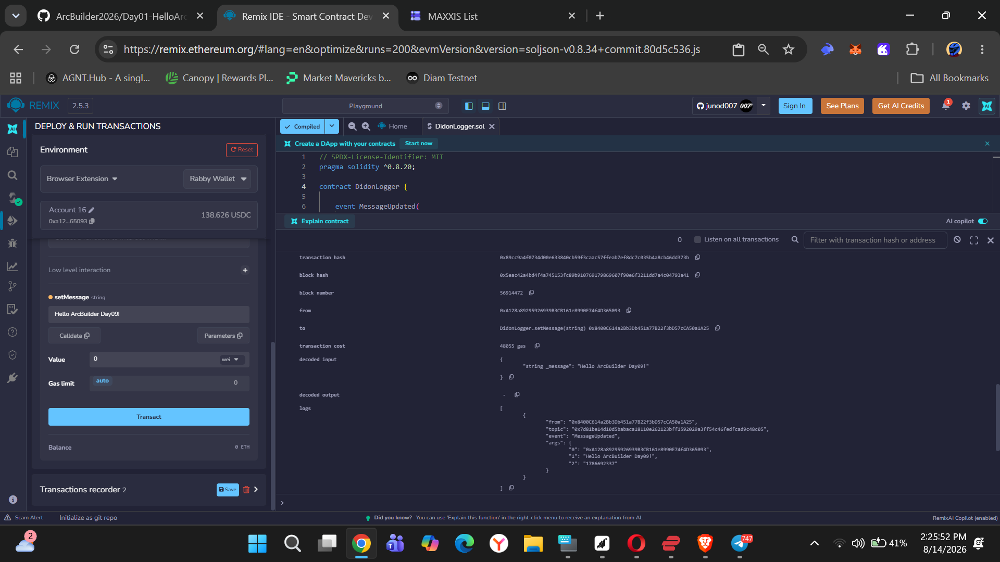
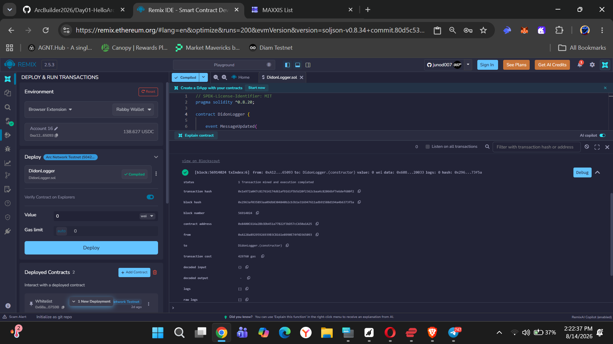
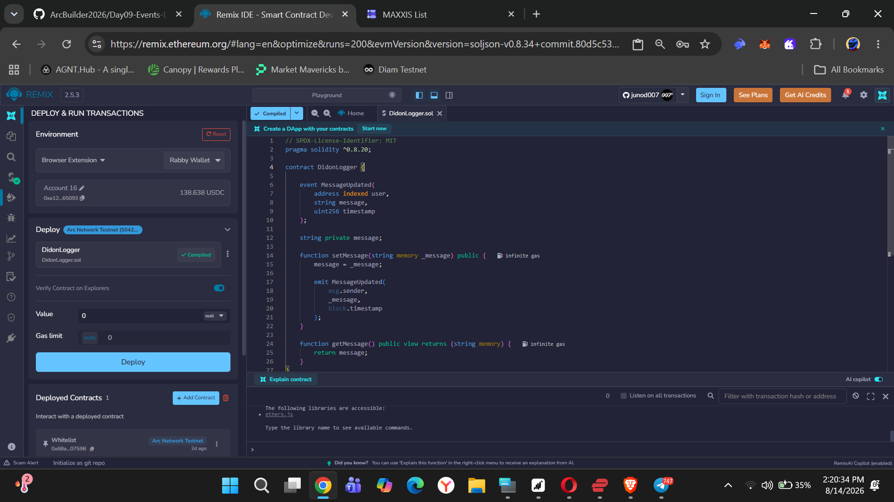
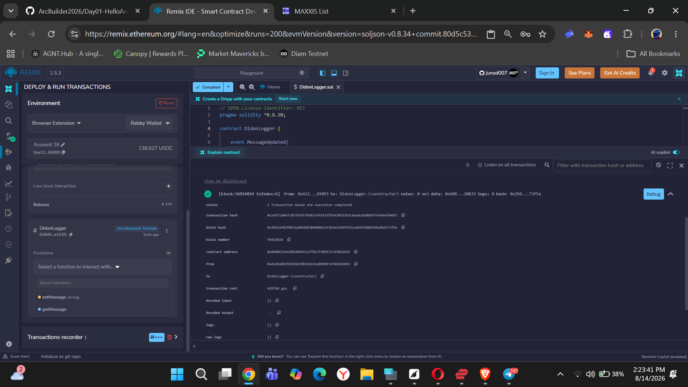

# Day 09 – Events & Logging

## 📌 Overview

Pada Day 09, saya mempelajari bagaimana Smart Contract menggunakan **Event** untuk mencatat aktivitas yang terjadi di blockchain.

Event berguna untuk memberikan informasi kepada aplikasi, frontend, atau pengguna ketika sebuah transaksi atau perubahan data terjadi di dalam Smart Contract.

---

## 📜 Smart Contract

Contract yang dibuat:

`DidonLogger.sol`

Fitur utama:

- 💾 Menyimpan pesan
- 🖊️ Mengubah pesan menggunakan `setMessage()`
- 📢 Mengirim Event `MessageUpdated`
- 🔍 Membaca pesan menggunakan `getMessage()`

---

## 📸 Screenshots

### 1. Source Code

### 2. Deploy Contract

### 3. Deployment Success

### 4. Set Message

### 5. Event Logged

### 6. Get Message Success

